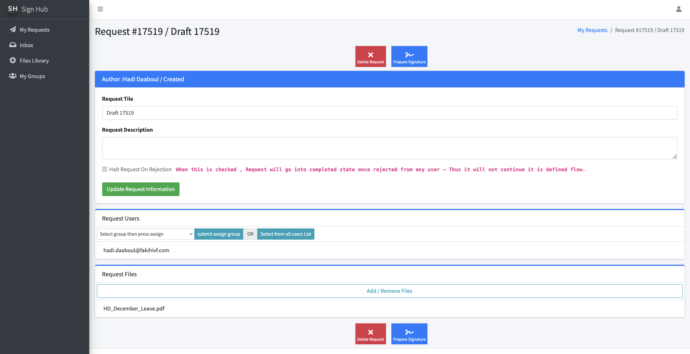
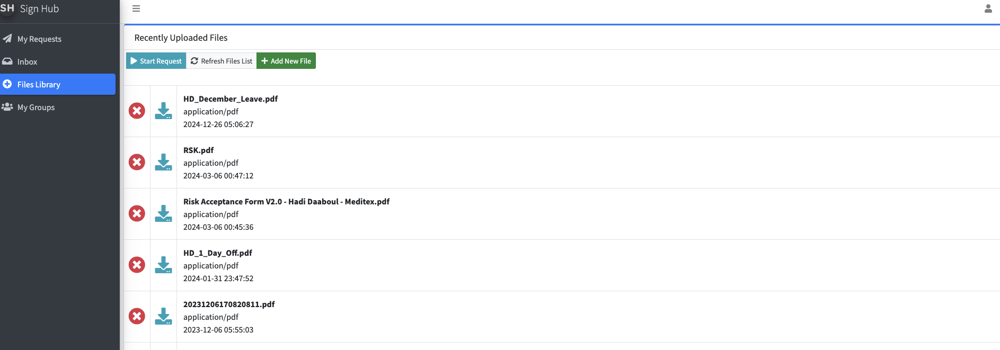
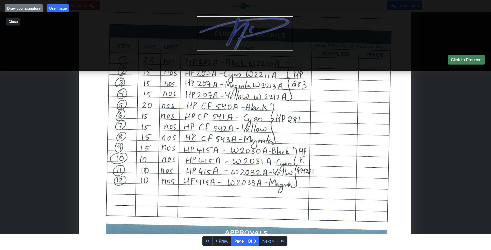
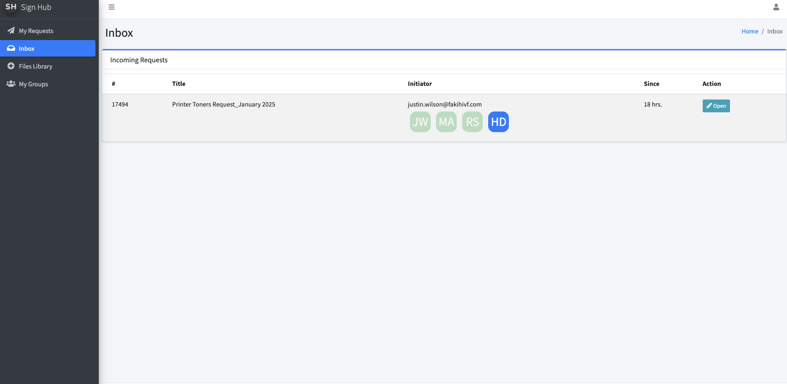

# signhub
# Back Office Approval and Digital Signature Platform  

## Overview  
This platform is a complete back-office solution designed to streamline approval workflows and automate digital signature processes. It empowers users to manage document approvals efficiently, ensuring secure and traceable transactions.

With an intuitive interface, users can upload documents, define approval workflows, and customize conditions such as halting the process upon rejection. The platform also features real-time email notifications, keeping users informed of every step from request initiation to completion.

---

## Features  

- **Approval Workflow Automation**  
  Create and manage approval workflows with ease. Define the order of signatories and tailor processes to meet organizational requirements.

- **Document Upload and Management**  
  Upload single or multiple PDFs, manage documents seamlessly, and prepare them for approval and signature.

- **Customizable Signing Rules**  
  Specify signing conditions, including the ability to halt the process at the first rejection, ensuring flexibility in handling approvals.

- **Digital Signature Integration**  
  Obtain signatures securely, eliminating the need for manual paperwork.

- **Real-Time Notifications**  
  Automated email notifications keep users informed when:  
  - A signing request is received.  
  - A document has been signed.  
  - The approval process is complete or rejected.

- **User-Friendly Interface**  
  Designed with simplicity in mind, the platform ensures that users of all technical levels can navigate and utilize its features efficiently.

---

## How It Works  

1. **Start a Signing Request**  
   - Upload one or more PDF documents.  
   - Define the signing order and assign signatories.

2. **Customize Workflow Conditions**  
   - Set rules for approvals, including halting on the first rejection if required.

3. **Track the Process**  
   - Receive real-time email updates at every step of the approval process.

4. **Complete the Workflow**  
   - Signatories receive the document via email, sign digitally, and the process concludes with a notification to all stakeholders.

---

## Visuals  

### Approval Workflow Overview  
  

### Document Upload Interface  
  

### Digital Signature Example  
  

### Incoming Requests  
  

---

## Benefits  

- **Efficiency**: Automates tedious manual approval processes, saving time and resources.  
- **Security**: Ensures document authenticity with secure digital signatures.  
- **Transparency**: Provides a clear audit trail for all approval activities.  
- **Scalability**: Adapts to various organizational needs, supporting both simple and complex workflows.  

---

Feel free to reach out for further details or to see the platform in action!
